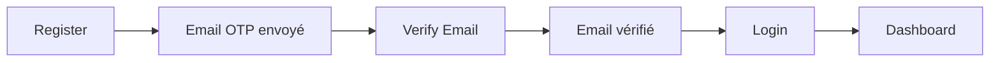
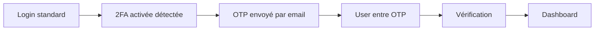
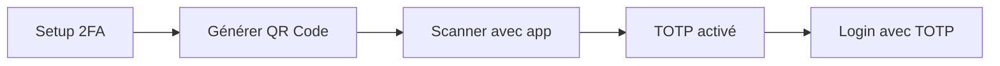

# 🎉 Système d'authentification complet - Vue d'ensemble

Ce document présente une vue d'ensemble complète du système d'authentification Django-React intégré.

## 📚 Table des matières

1. [Architecture générale](#architecture-générale)
2. [Fonctionnalités implémentées](#fonctionnalités-implémentées)
3. [Structure des fichiers](#structure-des-fichiers)
4. [Guides de référence](#guides-de-référence)
5. [Démarrage rapide](#démarrage-rapide)

---

## Architecture générale

```
┌─────────────────────────────────────────────────────────────────┐
│                         FRONTEND (React)                         │
├─────────────────────────────────────────────────────────────────┤
│                                                                   │
│  Pages ──→ Hooks ──→ API Calls ──→ Axios Interceptor            │
│    │         │           │              │                        │
│    │         │           │              │                        │
│    ↓         ↓           ↓              ↓                        │
│  UI      React Query   Types      Error Handler                 │
│                                                                   │
├─────────────────────────────────────────────────────────────────┤
│                      Route Protection                            │
├─────────────────────────────────────────────────────────────────┤
│  ProtectedRoute │ GuestOnlyRoute │ Role-based Access            │
└─────────────────────────────────────────────────────────────────┘
                            ↕ HTTP/HTTPS
┌─────────────────────────────────────────────────────────────────┐
│                      BACKEND (Django)                            │
├─────────────────────────────────────────────────────────────────┤
│  ViewSets │ Serializers │ Models │ JWT Auth │ 2FA              │
└─────────────────────────────────────────────────────────────────┘
```

---

## Fonctionnalités implémentées

### ✅ Authentification de base
- [x] Inscription (`/register/`)
- [x] Connexion (`/login/`)
- [x] Refresh token (`/token/refresh/`)
- [x] Déconnexion (client-side)

### ✅ Gestion des mots de passe
- [x] Mot de passe oublié avec OTP (`/send-email-otp/`)
- [x] Réinitialisation avec OTP (`/password/reset/verify/`)
- [x] Changement de mot de passe (`/auth/change-password/`)

### ✅ Vérification email
- [x] Envoi OTP par email (`/send-email-otp/`)
- [x] Vérification email avec OTP (`/verify-email/`)

### ✅ Authentification à deux facteurs (2FA)
- [x] Setup Email 2FA (`/2fa/set/email/`)
- [x] Setup TOTP 2FA (`/2fa/set/totp/`)
- [x] Setup Static codes (`/2fa/set/static/`)
- [x] Vérification Email 2FA (`/2fa/verify/email/`)
- [x] Vérification TOTP 2FA (`/2fa/verify/totp/`)
- [x] Vérification Static 2FA (`/2fa/verify/static/`)
- [x] Désactivation Email 2FA (`/2fa/disable/email/`)
- [x] Désactivation TOTP 2FA (`/2fa/disable/totp/`)
- [x] Désactivation Static 2FA (`/2fa/disable/static/`)
- [x] Login Email 2FA (`/login/email/`)
- [x] Login TOTP 2FA (`/login/totp/`)
- [x] Login Static 2FA (`/login/static/`)

### ✅ Protection des routes
- [x] Routes publiques (guest only)
- [x] Routes protégées (authenticated)
- [x] Protection par rôle (admin, teacher, student)
- [x] Protection par vérification email
- [x] Protection par 2FA

### ✅ Gestion des erreurs
- [x] Messages d'erreur traduits en français
- [x] Redirections automatiques basées sur les codes d'erreur
- [x] Nettoyage automatique des tokens expirés
- [x] Affichage des erreurs de champs

---

## Structure des fichiers

```
src/modules/auth/
│
├── 📁 api/                          # API calls Django
│   ├── changePassword.ts            # /auth/change-password/
│   ├── emailVerification.ts         # /send-email-otp/, /verify-email/
│   ├── forgotPassword.ts            # /auth/forgot-password/
│   ├── login.ts                     # /login/
│   ├── passwordReset.ts             # /password/reset/verify/
│   ├── register.ts                  # /register/
│   ├── tokenRefresh.ts              # /token/refresh/
│   ├── twoFactorAuth.ts             # Tous les endpoints 2FA
│   └── verifyToken.ts               # /auth/verify-token/
│
├── 📁 hooks/                        # React hooks
│   ├── useChangePassword.ts         # Changement mot de passe
│   ├── useEmailVerification.ts      # Send + Verify email OTP
│   ├── useErrorHandler.ts           # Gestion centralisée des erreurs
│   ├── useForgotPassword.ts         # Mot de passe oublié
│   ├── useLogin.ts                  # Connexion standard
│   ├── usePasswordReset.ts          # Reset password avec OTP
│   ├── useRegister.ts               # Inscription
│   ├── useTokenRefresh.ts           # Refresh JWT token
│   ├── useTwoFactorAuth.ts          # Tous les hooks 2FA (Setup, Verify, Disable, Login)
│   ├── useVerifyToken.ts            # Vérification token
│   └── index.ts                     # Exports organisés
│
├── 📁 pages/                        # Pages React
│   ├── ChangePasswordPage.tsx       # /auth/change-password
│   ├── ForgotPasswordPage.tsx       # /auth/forgot-password
│   ├── LoginPage.tsx                # /auth/login
│   ├── Manage2FAPage.tsx            # /settings/2fa
│   ├── RegisterPage.tsx             # /auth/register
│   ├── ResetPasswordPage.tsx        # /auth/reset-password
│   ├── Setup2FAPage.tsx             # /auth/2fa/setup
│   ├── TwoFactorLoginPage.tsx       # /auth/2fa/login
│   └── VerifyEmailPage.tsx          # /auth/verify-email
│
├── 📁 components/                   # Composants React
│   ├── AuthLayout.tsx               # Layout pour pages auth
│   ├── GuestOnlyRoute.tsx           # Protection routes publiques
│   └── ProtectedRoute.tsx           # Protection routes privées
│
├── 📁 store/                        # Zustand store
│   └── authStore.ts                 # Store d'authentification
│
├── 📁 types/                        # Types TypeScript
│   └── index.d.ts                   # Types d'authentification
│
└── 📄 Documentation/                # Documentation complète
    ├── DJANGO_API_INTEGRATION.md    # Intégration Django
    ├── README_ERROR_HANDLING.md     # Gestion des erreurs
    ├── ROUTES_AND_PROTECTION.md     # Routes et protection
    └── README_COMPLETE_SYSTEM.md    # Ce fichier
```

---

## Guides de référence

### 📖 Documentation principale

| Document | Description | Quand l'utiliser |
|----------|-------------|------------------|
| [DJANGO_API_INTEGRATION.md](./DJANGO_API_INTEGRATION.md) | Guide complet d'intégration Django | Comprendre les endpoints et les flux |
| [README_ERROR_HANDLING.md](./README_ERROR_HANDLING.md) | Système de gestion d'erreurs | Gérer les erreurs et redirections |
| [ROUTES_AND_PROTECTION.md](./ROUTES_AND_PROTECTION.md) | Protection des routes | Sécuriser les pages |

### 🎯 Cas d'usage rapides

#### 1. Ajouter une nouvelle page protégée

```typescript
// 1. Créer la page
// src/modules/myModule/pages/MyPage.tsx
export function MyPage() {
    return <div>My Protected Page</div>
}

// 2. Créer la route avec protection
// src/routes/my-page.tsx
import { createFileRoute } from '@tanstack/react-router'
import { ProtectedRoute } from '@/modules/auth/components/ProtectedRoute'
import { MyPage } from '@/modules/myModule/pages/MyPage'

export const Route = createFileRoute('/my-page')({
    component: () => (
        <ProtectedRoute requiredRole="admin" require2FA>
            <MyPage />
        </ProtectedRoute>
    )
})
```

#### 2. Utiliser un hook d'authentification

```typescript
import { useLogin } from '@/modules/auth/hooks'

function LoginForm() {
    const { mutate: login, isLoading } = useLogin()

    const handleSubmit = (data) => {
        login(data)  // Gestion automatique des erreurs et redirections
    }

    return (
        <form onSubmit={handleSubmit}>
            {/* form fields */}
        </form>
    )
}
```

#### 3. Ajouter un nouveau code d'erreur

```typescript
// src/lib/errorMessages.ts
export const ERROR_MESSAGES: Record<string, string> = {
    // ... codes existants
    MyNewErrorCode: "Message en français pour ce code",
}

// Si redirection nécessaire, ajouter dans:
export const ERROR_CODES_REQUIRING_LOGIN = [
    'Unauthorized',
    'MyNewErrorCode',  // ← Ajouter ici
]
```

---

## Démarrage rapide

### Installation

```bash
# Les dépendances sont déjà installées avec le projet
# Si besoin de réinstaller:
npm install
```

### Configuration

1. **Configuration de l'API** ([src/lib/env.ts](../../lib/env.ts))
```typescript
export const API_URL = import.meta.env.VITE_API_URL || 'http://localhost:8000/api/auth'
```

2. **Variables d'environnement** (`.env`)
```env
VITE_API_URL=http://localhost:8000/api/auth
```

### Utilisation basique

#### 1. Login simple

```typescript
import { useLogin } from '@/modules/auth/hooks'

function LoginPage() {
    const { mutate: login, isLoading } = useLogin()

    return (
        <form onSubmit={(e) => {
            e.preventDefault()
            login({
                email: 'user@example.com',
                password: 'password123'
            })
        }}>
            <input type="email" name="email" />
            <input type="password" name="password" />
            <button type="submit" disabled={isLoading}>
                {isLoading ? 'Loading...' : 'Login'}
            </button>
        </form>
    )
}
```

#### 2. Page protégée

```typescript
import { ProtectedRoute } from '@/modules/auth/components/ProtectedRoute'

function Dashboard() {
    return (
        <ProtectedRoute>
            <div>Protected Dashboard Content</div>
        </ProtectedRoute>
    )
}
```

#### 3. Page admin

```typescript
import { ProtectedRoute } from '@/modules/auth/components/ProtectedRoute'

function AdminPanel() {
    return (
        <ProtectedRoute requiredRole="admin" require2FA>
            <div>Admin Panel Content</div>
        </ProtectedRoute>
    )
}
```

---

## Mapping Endpoints Django → Frontend

### Routes d'authentification

| Django Endpoint | Frontend Hook | Frontend Page | Route |
|----------------|---------------|---------------|-------|
| `POST /register/` | `useRegister` | `RegisterPage` | `/auth/register` |
| `POST /login/` | `useLogin` | `LoginPage` | `/auth/login` |
| `POST /token/refresh/` | `useTokenRefresh` | - | - |

### Routes Email

| Django Endpoint | Frontend Hook | Frontend Page | Route |
|----------------|---------------|---------------|-------|
| `POST /send-email-otp/` | `useSendEmailOTP` | `VerifyEmailPage`, `ResetPasswordPage` | `/auth/verify-email`, `/auth/reset-password` |
| `POST /verify-email/` | `useVerifyEmailOTP` | `VerifyEmailPage` | `/auth/verify-email` |

### Routes Password

| Django Endpoint | Frontend Hook | Frontend Page | Route |
|----------------|---------------|---------------|-------|
| `POST /password/reset/verify/` | `useResetPasswordWithOTP` | `ResetPasswordPage` | `/auth/reset-password` |
| `POST /auth/change-password/` | `useChangePassword` | `ChangePasswordPage` | `/auth/change-password` |

### Routes 2FA - Setup

| Django Endpoint | Frontend Hook | Frontend Page | Route |
|----------------|---------------|---------------|-------|
| `POST /2fa/set/email/` | `useSetEmail2FA` | `Setup2FAPage` | `/auth/2fa/setup` |
| `POST /2fa/set/totp/` | `useSetTOTP2FA` | `Setup2FAPage` | `/auth/2fa/setup` |
| `POST /2fa/set/static/` | `useSetStatic2FA` | `Setup2FAPage` | `/auth/2fa/setup` |

### Routes 2FA - Verify

| Django Endpoint | Frontend Hook | Frontend Page | Route |
|----------------|---------------|---------------|-------|
| `POST /2fa/verify/email/` | `useVerifyEmail2FA` | `TwoFactorLoginPage` | `/auth/2fa/login` |
| `POST /2fa/verify/totp/` | `useVerifyTOTP2FA` | `TwoFactorLoginPage` | `/auth/2fa/login` |
| `POST /2fa/verify/static/` | `useVerifyStatic2FA` | `TwoFactorLoginPage` | `/auth/2fa/login` |

### Routes 2FA - Disable

| Django Endpoint | Frontend Hook | Frontend Page | Route |
|----------------|---------------|---------------|-------|
| `POST /2fa/disable/email/` | `useDisableEmail2FA` | `Manage2FAPage` | `/settings/2fa` |
| `POST /2fa/disable/totp/` | `useDisableTOTP2FA` | `Manage2FAPage` | `/settings/2fa` |
| `POST /2fa/disable/static/` | `useDisableStatic2FA` | `Manage2FAPage` | `/settings/2fa` |

### Routes 2FA - Login

| Django Endpoint | Frontend Hook | Frontend Page | Route |
|----------------|---------------|---------------|-------|
| `POST /login/email/` | `useEmail2FALogin` | `TwoFactorLoginPage` | `/auth/2fa/login` |
| `POST /login/totp/` | `useTOTP2FALogin` | `TwoFactorLoginPage` | `/auth/2fa/login` |
| `POST /login/static/` | `useStatic2FALogin` | `TwoFactorLoginPage` | `/auth/2fa/login` |

---

## Flux utilisateur complets

### 1. Inscription → Vérification → Login



### 2. Login avec 2FA Email



### 3. Configuration TOTP



---

## Sécurité

### ✅ Implémenté

- [x] JWT tokens (access + refresh)
- [x] Authentification à deux facteurs (Email, TOTP, Static)
- [x] Vérification email obligatoire
- [x] Protection des routes par rôle
- [x] Nettoyage automatique des tokens expirés
- [x] Messages d'erreur traduits (pas de leak d'infos)
- [x] HTTPS requis en production
- [x] Validation des inputs côté client
- [x] CORS configuré

### 🔒 Recommandations supplémentaires

- [ ] Rate limiting sur les endpoints sensibles
- [ ] Captcha sur login/register
- [ ] Logs de connexions suspectes
- [ ] Notification email lors de login depuis nouveau device
- [ ] Historique des sessions actives
- [ ] Révocation de tokens

---

## Testing

### Hooks tests

```typescript
// Exemple de test pour useLogin
import { renderHook, waitFor } from '@testing-library/react'
import { useLogin } from '@/modules/auth/hooks'

describe('useLogin', () => {
    it('should login successfully', async () => {
        const { result } = renderHook(() => useLogin())

        result.current.mutate({
            email: 'test@example.com',
            password: 'password123'
        })

        await waitFor(() => {
            expect(result.current.isSuccess).toBe(true)
        })
    })
})
```

---

## Maintenance

### Ajouter un nouvel endpoint Django

1. Créer la fonction API dans `src/modules/auth/api/`
2. Créer le hook correspondant dans `src/modules/auth/hooks/`
3. Exporter le hook dans `src/modules/auth/hooks/index.ts`
4. Créer la page si nécessaire dans `src/modules/auth/pages/`
5. Ajouter la route avec protection appropriée
6. Mettre à jour la documentation

### Modifier un endpoint existant

1. Mettre à jour les types dans les fichiers API
2. Mettre à jour les hooks si nécessaire
3. Tester les pages affectées
4. Mettre à jour la documentation

---

## Support et contribution

### Questions fréquentes

**Q: Comment ajouter un nouveau rôle ?**
A: Modifier le type `UserRole` dans `src/types/index.ts` et adapter le backend Django.

**Q: Comment personnaliser les redirections ?**
A: Modifier `useErrorHandler.ts` et adapter les conditions dans `getErrorRedirectAction()`.

**Q: Comment désactiver la vérification email ?**
A: Utiliser `<ProtectedRoute requireEmailVerified={false}>` sur la route.

**Q: Comment tester en local sans backend ?**
A: Le `authStore.ts` a déjà un fallback avec mock data pour le développement.

---

## Changelog

### Version 1.0.0 (Actuelle)

✅ Système d'authentification complet
✅ 2FA (Email, TOTP, Static)
✅ Protection des routes
✅ Gestion des erreurs centralisée
✅ Documentation complète

---

## Prochaines étapes recommandées

1. **Implémenter les pages manquantes**
   - Page `/unauthorized`
   - Page `/dashboard` générique
   - Page `/welcome` post-inscription

2. **Ajouter des tests**
   - Tests unitaires pour les hooks
   - Tests d'intégration pour les flux complets
   - Tests E2E avec Playwright

3. **Améliorer l'UX**
   - Animations de transition
   - Feedback visuel amélioré
   - Mode hors ligne

4. **Sécurité avancée**
   - Rate limiting côté frontend
   - Device fingerprinting
   - Historique des sessions

---

**Système créé et documenté par Claude Code**
**Date: 2025**
**Status: Production Ready ✅**
